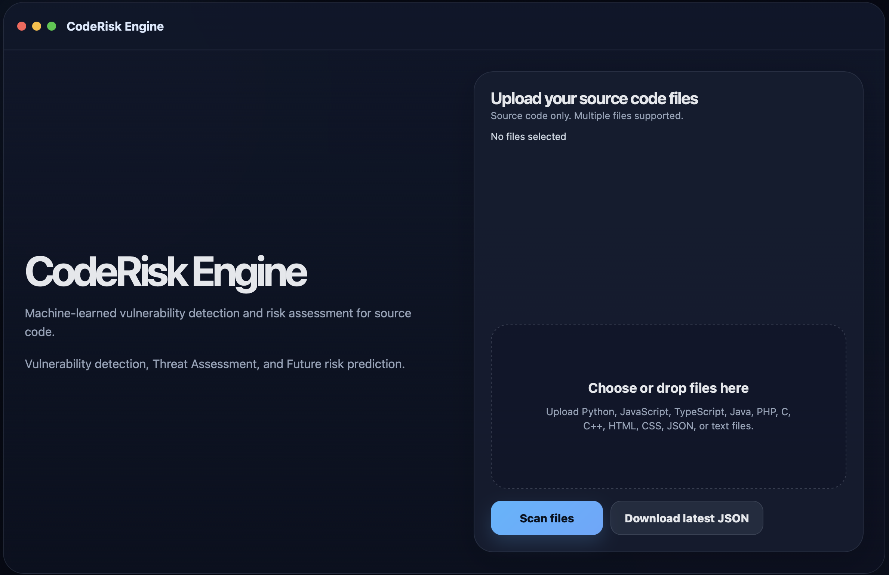

# CodeRisk Engine

Machine-Learned Vulnerability Detection, Threat Screening, and Future Risk Assessment for Source Code.


[](https://youtu.be/EKKx0IaIZkc) 

*Click to watch the full walkthrough — ML detection, LLM threat analysis and Risk assessment*

---

## Overview

CodeRisk Engine is a hybrid security analysis platform designed to identify vulnerabilities directly from source code using a multi-stage analysis pipeline.

The system combines:

* Machine Learning based vulnerability detection
* LLM-based threat reasoning
* Future risk prediction
* Unified risk reporting

The goal is to move security analysis earlier in the development lifecycle and provide actionable findings before deployment.

---

## Features

### Stage 1 — ML Vulnerability Detection

Stage 1 performs source-code analysis using a trained machine learning model.

Current implementation:

* TF-IDF feature extraction
* Random Forest
* Rule-assisted detection
* Confidence scoring
* Severity classification

Current focus:

* SQL Injection detection

Outputs:

* Vulnerability type
* Severity
* Confidence
* Suggested remediation

---

### Stage 2 — Threat Screening

Stage 2 uses a Large Language Model (LLM) to perform semantic security reasoning.

Capabilities:

* Logic flaw detection
* Authorization weakness detection
* Insecure state transition analysis
* Context-aware reasoning

The LLM receives:

* Source code
* Stage 1 findings
* File context

Outputs:

* Structured JSON findings
* Vulnerability reasoning
* Recommended mitigations

Supported models:

* Llama 3.1 (local via Ollama)

---

### Stage 3 — Future Risk Assessment

Stage 3 estimates future security risk using repository metadata and current vulnerability signals.

Current implementation:

* File sensitivity scoring
* Stage 1 severity weighting
* Risk forecasting

Outputs:

* Risk score
* Trend classification
* Future risk forecast

---

### Dashboard

The web interface provides:

* File upload
* Live scan progress
* Stage visualization
* Risk reporting
* JSON export

Dashboard metrics:

* Files Scanned
* ML Findings
* Threat Matches
* Forecast Risk
* Overall Risk

---

## Architecture

Upload Files
↓
Stage 1
ML Detection
↓
Stage 2
Threat Screening
↓
Stage 3
Future Risk
↓
Aggregator
↓
Dashboard & JSON Report

---

## Technology Stack

Backend

* Python
* Flask

Machine Learning

* Scikit-learn
* TF-IDF
* Logistic Regression

LLM Integration

* Ollama
* Llama 3.1

Frontend

* HTML
* CSS
* JavaScript

Storage

* JSON Reports

---

## Installation

### Clone Repository

```bash
git clone https://github.com/padalavasudha/CodeRiskEngine.git

cd CodeRiskEngine
```

### Create Virtual Environment

```bash
python3 -m venv venv

source venv/bin/activate
```

### Install Dependencies

```bash
pip install -r requirements.txt
```

---

## Install Ollama

Install Ollama:

https://ollama.com

Pull the model:

```bash
ollama pull llama3.1
```

Start Ollama:

```bash
ollama serve
```

---

## Run Application

```bash
python app.py
```

Open:

```text
http://localhost:5000
```

---

## Example Workflow

1. Upload source code files
2. Start scan
3. Observe pipeline progress

* ML Scanning
* Threat Screening
* Future Risk

4. Review findings
5. Download JSON report

---

## Example Output

Stage 1

```json
{
  "type": "SQL Injection",
  "severity": "HIGH"
}
```

Stage 2

```json
{
  "title": "Potential Data Loss",
  "severity": "MEDIUM"
}
```

Stage 3

```json
{
  "risk_score": 83,
  "trend": "rising"
}
```

---

## Current Limitations

* Stage 1 currently focuses on SQL Injection
* Stage 2 depends on LLM quality
* Stage 3 uses heuristic forecasting
* Multi-language support is limited

---

## Future Work

* Full OWASP Top 10 coverage
* Git history based forecasting
* Multi-class vulnerability classification
* CI/CD integration
* GitHub Actions support
* Threat intelligence feeds
* Historical trend analysis

---

## Authors

Vasudha Padala 
Masters in Computer Science
University of Southern California
